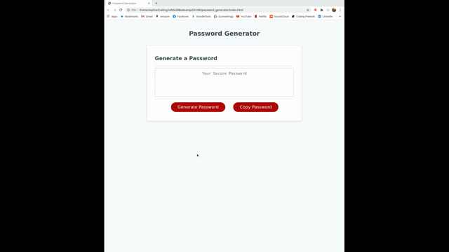
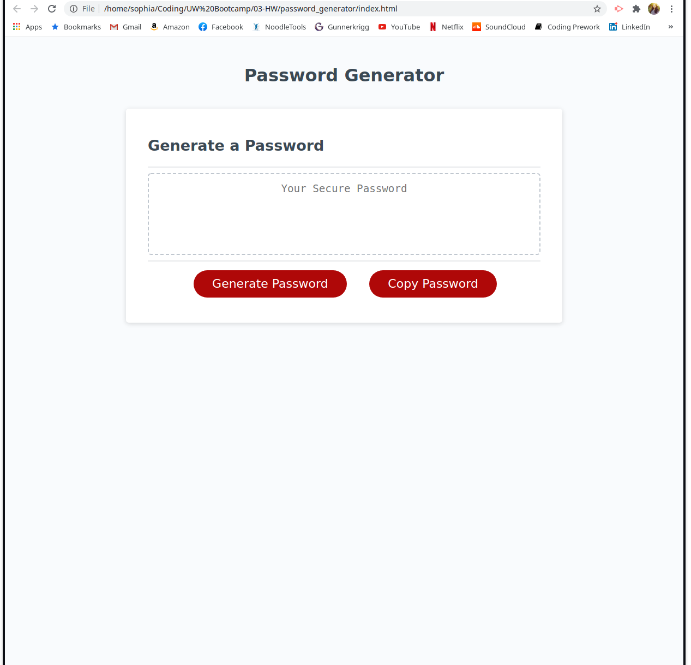
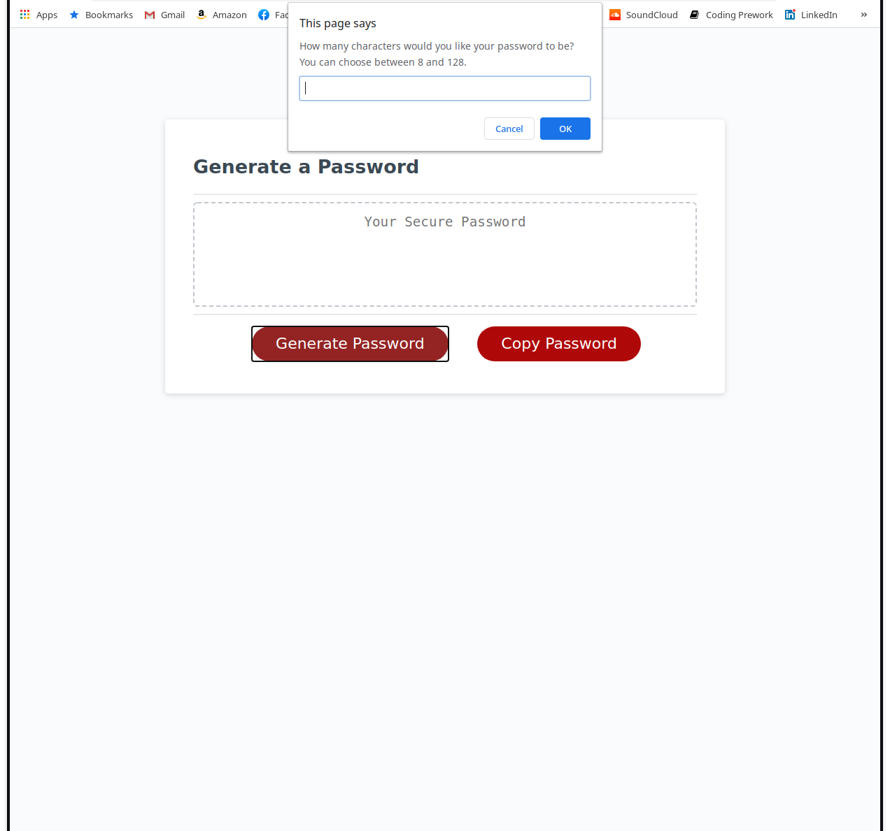
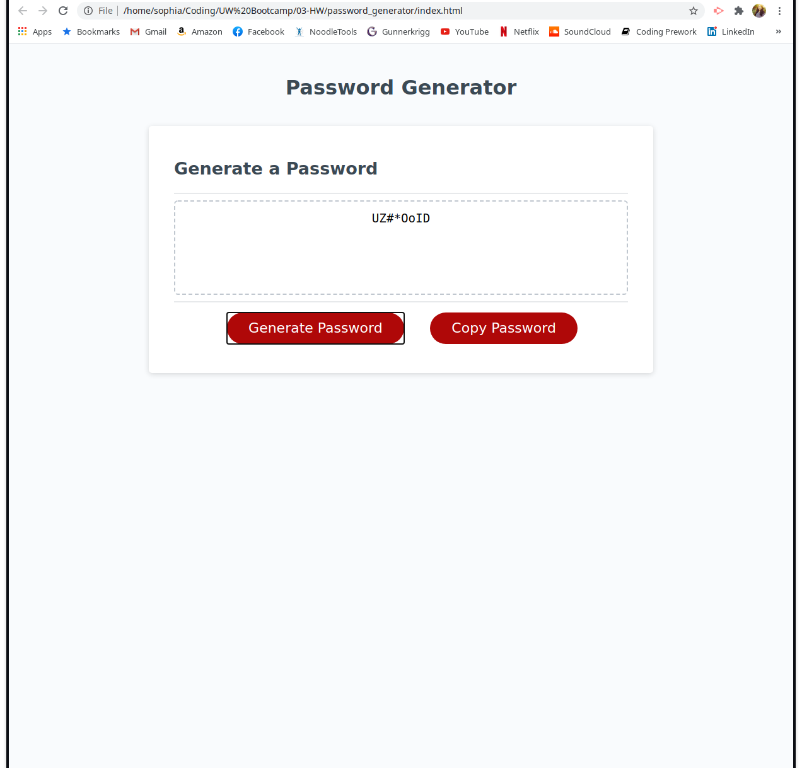
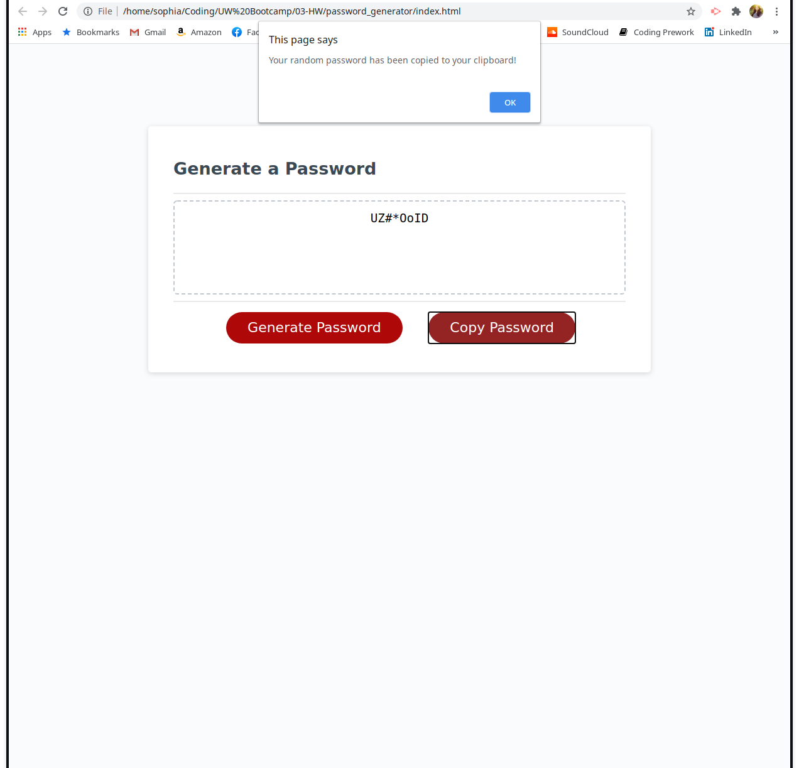

# Random Password Generator

## Description

This repository is comprised of an HTML, JavaScript, and two CSS files. One CSS file is reset file to reduce browser inconsistencies and the other is the style sheet used to style the page.

The page prompts the user for a password length (between 8-128 characters) and four criteriums - numbers, special characters, uppercase letters, and lowercase letters. Once the criteriums are chosen, the random password is created and dislayed in the dashed text box. The user can then choose to copy the random password to their clipboard. 

This project focuses on the use of JavaScript logic, conditional statements, functions, and DOM knowledge to generate the random password. It also focuses on the use of JavaScript to dynamically edit HTML. 

## Access and Installation

This project can be accessed either via the GitHub Repository page or the deployed live public page.

- [GitHub Repository](https://github.com/sophia2798/password_generator)
- [Deployed Page](https://sophia2798.github.io/password_generator/)

To open and edit code files, you will need a text editor. The one used to create this page was Visual Studio Code (https://code.visualstudio.com/).

To install this repository, you can git clone the repository using the green "Code" button. You can copy and paste either the HTML or SSH URL.

## Usage

This project can be used to generate random passwords given the four aforementioned criterium. It can also be used as a template to explore the use of conditional statements, nesting, proper variable and function assignments, and dyanmic programming. 

Studying the HTMl and JavaScript code can also help one familiarize themselves with DOM layouts and standards. 

## Features

- A text box, working buttons that initailize JavaScript functions, and proper styling

- Prompts for user chosen criterium

- JavaScript to dynamically change the text box and show the generated password

- An option/button to copy the generated password to the user's clipboard

## Authors

- Sophia Jung - [GitHub Profile](https://github.com/sophia2798)
- UW Coding Bootcamp/Trinity Education Services

## Credits 

- [W3 Schools](https://www.w3schools.com/default.asp) 

- [Stack Overflow](https://stackoverflow.com/)